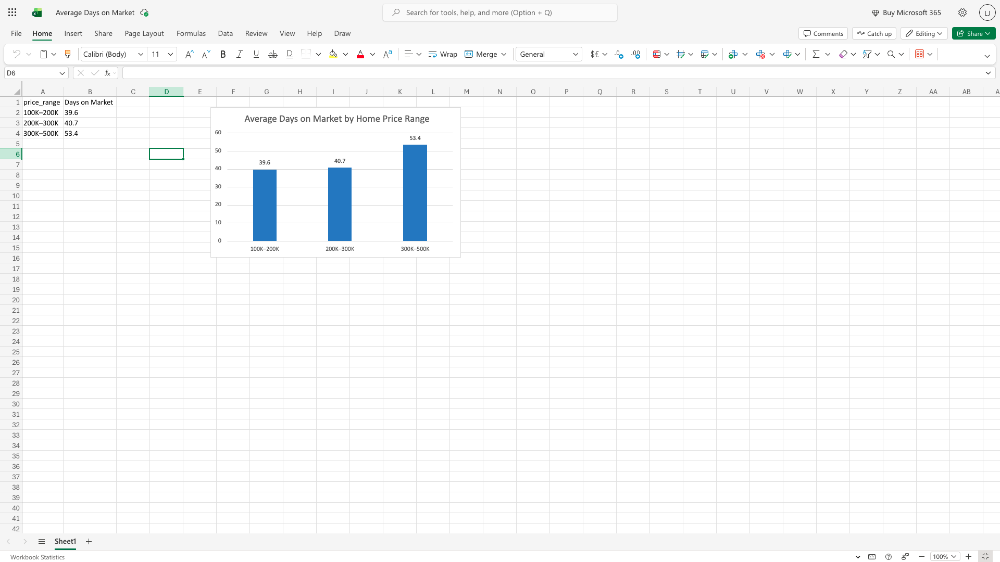

# shelby-county-home-sales-analysis-
SQL analysis of 5,000+ real estate transactions to evaluate pricing strategy, days on market, and market trends in Shelby County, TN.

# 🏡 Shelby County Home Sales Analysis

## 📊 Project Overview

This project analyzes residential real estate transactions in Shelby County, TN to identify pricing strategies and market trends. The goal is to understand how listing price impacts sale price and time on market.

---

## 💼 Business Problem

How can real estate agents price homes to sell faster while maximizing sale price?

---

## 📁 Dataset

* Source: MLS export
* Scope: Single-family homes
* Timeframe: Since April 2025
* Price Range: $100K–$500K
* Records: ~5,000+ sales

---

## 🛠️ Tools Used

* SQLite (DB Browser)
* SQL (data cleaning & analysis)

---

## 🔧 Data Cleaning

* Removed currency symbols ($, commas) from price fields
* Converted price fields to numeric
* Created derived columns:

  * `sale_to_list_ratio`

---

## 📈 Key Metrics

* **Average Sale Price Ratio:** 0.977
* **Average Days on Market:** 46.1 days

---

## 🧠 Key Insights

* Homes sell at ~97.7% of list price on average
* Sellers typically accept a ~2–3% discount
* Market conditions indicate a balanced to slightly buyer-favorable market

---

## 📍 ZIP Code Analysis

(you will fill this after next query)

Example:

* Fastest-selling ZIP codes had significantly lower days on market
* Certain areas showed stronger pricing power (higher sale-to-list ratio)

---

## 🚀 SQL Highlights

### Data Cleaning

```sql
UPDATE shelby_county_home_sales
SET 
    list_price = REPLACE(REPLACE(list_price, '$', ''), ',', ''),
    sale_price = REPLACE(REPLACE(sale_price, '$', ''), ',', '');
```

### KPI Creation

```sql
ALTER TABLE shelby_county_home_sales ADD COLUMN sale_to_list_ratio REAL;

UPDATE shelby_county_home_sales
SET sale_to_list_ratio = 
    CAST(sale_price_num AS REAL) / list_price_num;
```

### Market Summary

```sql
SELECT 
    ROUND(AVG(sale_to_list_ratio), 3) AS avg_ratio,
    ROUND(AVG(days_on_market), 1) AS avg_dom
FROM shelby_county_home_sales;
```

---
## 📊 Days on Market by Price Range



*Homes in higher price ranges tend to stay on the market longer compared to lower-priced homes.*
## 🧠 Key Insight: Pricing vs Time on Market

Homes priced between $300K–$500K take significantly longer to sell (53.4 days) compared to lower price ranges (~40 days).

This suggests that higher-priced homes experience lower demand or require more time for buyers to commit, while lower-priced homes move more quickly in the market.


## 🏁 Conclusion

This analysis demonstrates how pricing strategy directly impacts time on market and final sale outcomes. Proper pricing can reduce time to sale while minimizing discounts.

---


## 📌 Future Improvements

* Add time-based trends (monthly analysis)
* Build dashboard (Power BI / Tableau)
* Include active listings for full market view
